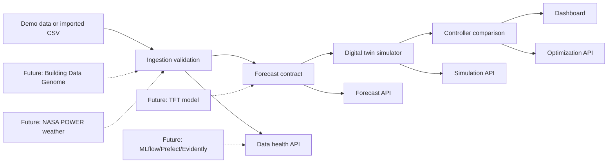
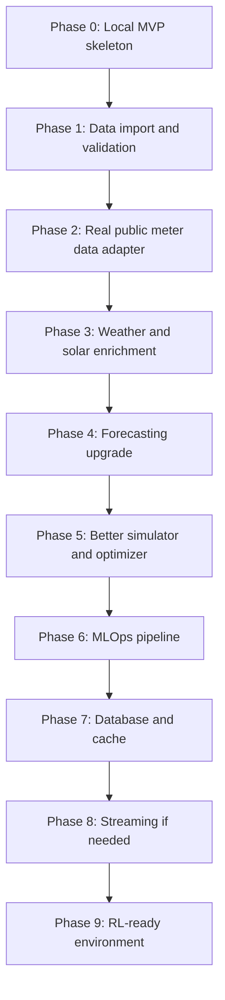

# AI Energy Twin Roadmap

This document is the project map. Before each major build step, we should update this file so it is clear what exists, what is next, and what decisions are still open.

For component-level architecture, see [system-design.md](system-design.md).

## What We Are Building

AI Energy Twin is a non-RL digital twin for a building. It predicts energy demand and solar generation, simulates energy-control decisions, and compares baseline vs optimized operation.

The first serious version is:

- one commercial building
- hourly data
- 24-hour forecast horizon
- solar + battery + grid import/export simulation
- baseline, rule-based, and optimized controllers
- dashboard for forecast, scenario lab, policy comparison, and MLOps/data health

TD-MPC2/RL comes later after the simulator and data layer are stable.

## Current System Diagram

## Build Timeline

## Phase Status

| phase | status | what it means |
| --- | --- | --- |
| 0. Local MVP skeleton | Done | Dashboard, APIs, forecast contract, simulator, optimizer, tests |
| 1. Data import and validation | Done | CSV import, schema validation, data-health UI |
| 2. Real public meter data adapter | Downloader + preparation ready | Download direct CSV/ZIP public data and convert one building into our schema |
| 3. Weather and solar enrichment | NASA POWER adapter ready | Add weather/solar/price/carbon columns by timestamp |
| 4. Forecasting upgrade | Regression + local MLP ready | DL model must beat promoted regression benchmark |
| 5. Simulator and optimizer upgrade | Configurable economics ready | More realistic battery, tariff, comfort, HVAC behavior |
| 6. MLOps pipeline | Local monitoring ready | MLflow, richer drift monitoring |
| 7. Database and cache | Postgres + Redis adapters ready | Opt-in production run storage and API response caching |
| 8. Streaming | Deferred | Kafka/Flink only if live telemetry needs it |
| 9. RL-ready environment | Deferred | Gymnasium-style interface for future TD-MPC2 |

## Decision Log

| decision | options | current choice | why |
| --- | --- | --- | --- |
| First data layer | demo only, CSV, DuckDB, Postgres | CSV + validation | Teaches schema discipline without infrastructure overhead |
| Forecast model now | coded baseline, local artifact, TFT immediately | regression + local MLP artifacts | Stronger local benchmark plus first dependency-free DL model |
| Streaming now | none, Kafka, Kafka + Flink | none | No live telemetry yet |
| Database now | files, SQLite, DuckDB, Postgres/TimescaleDB | SQLite locally, Postgres optional | Keep laptop workflow simple while enabling production run storage |
| Cache now | none, in-process, Redis | Redis optional | Cache expensive API responses only when a Redis URL is configured |
| Public meter data | downloader, adapter, manual CSV only | downloader + adapter | Supports real data shape while keeping dataset choice explicit |
| Public dataset prep | manual import, one preparation command, auto downloader | downloader + preparation command | Automates local public CSV/ZIP fetch and conversion |
| Weather enrichment | NASA POWER first, manual join, placeholders | manual join | Teaches the join contract before adding an external API |
| Forecasting upgrade | jump to deep learning, measured baseline first | measured baseline | Gives us metrics before adding heavier ML |
| Simulator economics | energy cost only, demand charge, battery wear | demand charge + battery wear | Makes peak reduction and cycling tradeoffs visible |
| Economic assumptions | hardcoded, API params, dashboard controls | dashboard controls | Lets users test policy sensitivity without code changes |
| Scenario assumptions | fixed presets, API params, dashboard controls | dashboard controls | Lets users tune weather, price, EV, and comfort assumptions |
| Optimizer economics | fixed schedule scoring, tariff-aware schedule | tariff-aware schedule | Policy actions now respond to tariff and wear assumptions |
| Weather source | manual CSV only, NASA POWER adapter | NASA POWER adapter | Automates temperature and solar enrichment while preserving CSV join path |
| MLOps first step | no tracking, local JSON, MLflow now | local JSON | Establishes run contract before adding MLflow/Prefect |
| Run history | latest file only, SQLite, MLflow | SQLite | Lets dashboard/API compare recent local runs without new services |
| Scheduler | manual command, cron, Prefect | project-owned scheduler script | Gives repeatable local automation before installing system cron or adding Prefect |
| Retraining first step | no retraining, local artifact, MLflow registry | local artifact + promotion gate | Makes retraining concrete without a service dependency |
| Daily monitoring | none, dashboard summary, Evidently | dashboard summary | Daily runs need trend visibility, not heavy monitoring infrastructure yet |
| Daily automation | manual, launchd, cron, Prefect | launchd generator | macOS can run one local pipeline per day without a long-running loop |
| First DL model | no DL, dependency-free MLP, PyTorch TFT | dependency-free MLP | Teaches real backprop training before adding heavy model infrastructure |

## Next Step

Recommended next step: choose whether to add deep-learning dependencies or import more realistic public data.

That means:

1. Add N-HiTS/PatchTST training, or
2. Import and enrich a real public building dataset, or
3. Move the local scheduler into Prefect.

Options:

- **Deep-learning model**: tests whether DL beats the promoted regression artifact.
- **Real public data**: gives the models something less synthetic to learn.
- **Prefect scheduler**: adds retries, logs, and pipeline history.

My recommendation: import and enrich a real public dataset next, then add DL once the data is less synthetic.
