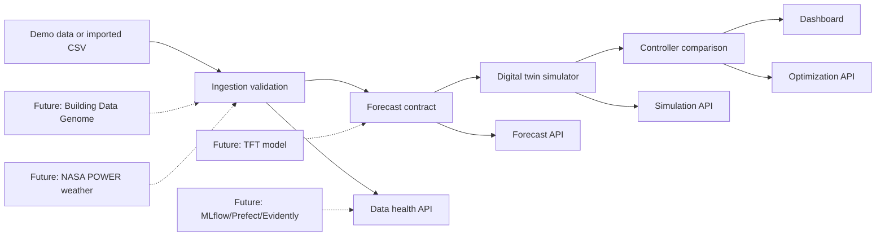
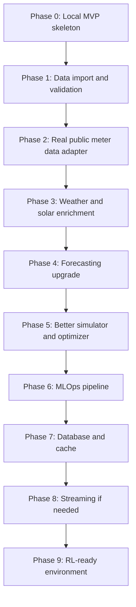

# AI Energy Twin Roadmap

This document is the project map. Before each major build step, we should update this file so it is clear what exists, what is next, and what decisions are still open.

For component-level architecture, see [system-design.md](system-design.md).

## What We Are Building

AI Energy Twin is a non-RL digital twin for a building. It predicts energy demand and solar generation, simulates energy-control decisions, and compares baseline vs optimized operation.

The first serious version is:

- one commercial building
- hourly data
- 24-hour forecast horizon
- solar + battery + grid import/export simulation
- baseline, rule-based, and optimized controllers
- dashboard for forecast, scenario lab, policy comparison, and MLOps/data health

TD-MPC2/RL comes later after the simulator and data layer are stable.

## Current System Diagram

## Build Timeline

## Phase Status

| phase | status | what it means |
| --- | --- | --- |
| 0. Local MVP skeleton | Done | Dashboard, APIs, forecast contract, simulator, optimizer, tests |
| 1. Data import and validation | In progress | CSV import, schema validation, data-health UI |
| 2. Real public meter data adapter | Adapter ready | Convert Building Data Genome-style meter data into our schema |
| 3. Weather and solar enrichment | NASA POWER adapter ready | Add weather/solar/price/carbon columns by timestamp |
| 4. Forecasting upgrade | Baseline metrics ready | Replace seasonal baseline with stronger models |
| 5. Simulator and optimizer upgrade | Configurable economics ready | More realistic battery, tariff, comfort, HVAC behavior |
| 6. MLOps pipeline | Not started | MLflow, pipeline runs, evaluation, drift monitoring |
| 7. Database and cache | Not started | Postgres/TimescaleDB and Redis |
| 8. Streaming | Deferred | Kafka/Flink only if live telemetry needs it |
| 9. RL-ready environment | Deferred | Gymnasium-style interface for future TD-MPC2 |

## Decision Log

| decision | options | current choice | why |
| --- | --- | --- | --- |
| First data layer | demo only, CSV, DuckDB, Postgres | CSV + validation | Teaches schema discipline without infrastructure overhead |
| Forecast model now | simple baseline, TFT immediately | simple baseline contract | Lets UI/simulator stabilize before training complexity |
| Streaming now | none, Kafka, Kafka + Flink | none | No live telemetry yet |
| Database now | files, DuckDB, Postgres/TimescaleDB | files | Faster iteration while schema is still changing |
| Public meter data | downloader, adapter, manual CSV only | adapter | Supports real data shape without network or large files |
| Weather enrichment | NASA POWER first, manual join, placeholders | manual join | Teaches the join contract before adding an external API |
| Forecasting upgrade | jump to deep learning, measured baseline first | measured baseline | Gives us metrics before adding heavier ML |
| Simulator economics | energy cost only, demand charge, battery wear | demand charge + battery wear | Makes peak reduction and cycling tradeoffs visible |
| Economic assumptions | hardcoded, API params, dashboard controls | dashboard controls | Lets users test policy sensitivity without code changes |
| Scenario assumptions | fixed presets, API params, dashboard controls | dashboard controls | Lets users tune weather, price, EV, and comfort assumptions |
| Optimizer economics | fixed schedule scoring, tariff-aware schedule | tariff-aware schedule | Policy actions now respond to tariff and wear assumptions |
| Weather source | manual CSV only, NASA POWER adapter | NASA POWER adapter | Automates temperature and solar enrichment while preserving CSV join path |

## Next Step

Recommended next step: choose whether to improve the forecasting model or improve the simulator.

That means:

1. Add a stronger statistical forecasting baseline, or
2. Improve simulator realism with tariff demand charges and battery degradation, or
3. Add NASA POWER as an automated weather producer.

Options:

- **Forecasting baseline**: teaches evaluation and makes the AI part more real.
- **Simulator improvements**: makes policy comparison more credible.
- **NASA POWER adapter**: automates weather enrichment now that the join contract exists.

My recommendation: improve the forecasting baseline next, then add NASA POWER.
